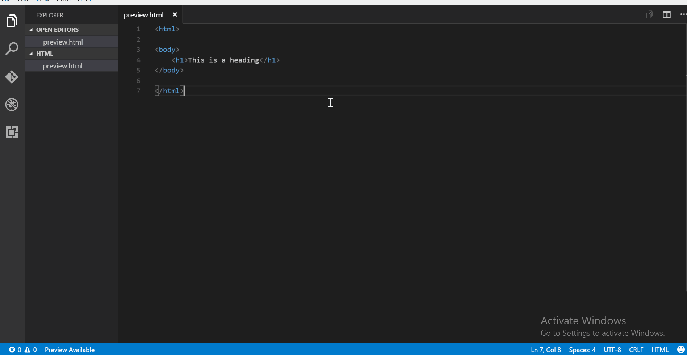

# Live HTML Previewer
This extension allows you to preview your html files in VS Code itself. Use it to quickly set the html and css right for your webpages.
##### Note: Javascript is not supported in preview
### Features
#### Side preview with live editing

#### Full page preview
#### Open html file in browser
### Usage
* For side preview, use the keybinding 'ctrl+q s', or press 'F1' and type "Show side preview", or click the preview icon in the editor tab toolbar
* For full preview, use the keybinding 'ctrl+q f', or press 'F1' and type "Show full preview", or alt-click the preview icon
* You can also right-click an .html file's tab and choose "Reopen Editor With..." -> "Live HTML Preview" to preview it in place
* Right-click an .html file (in the editor or the Explorer) for a "Preview" submenu: Side Preview and Full Preview, each with Auto/Light/Dark, plus "Open in browser" - pick one to start a preview already in the mode you want, in one click
* To open file in browser:
    * use the keybinding 'ctrl+q w' or
    * press 'F1' and type "Open in browser" or
    * right-click an .html file (editor or Explorer) -> Preview -> "Open in browser"
    * over Remote-SSH/WSL/Codespaces this first tries VS Code's built-in Simple Browser tab, falling back to your external browser if that doesn't work for your setup

If a HTML file is open, two icons appear on the Status Bar in the bottom left: one to open the side preview, and one showing the current preview theme. The theme item stays visible and accurate whenever a preview panel is focused too, not just its source file.

### Preview theme (auto / light / dark)
`auto` (the default) shows the previewed page exactly as authored, including its own dark-mode CSS, like a real browser would. `light`/`dark` force a plain background regardless of the page's own styling. `liveHtmlPreview.previewTheme` is a global setting, so it persists across restarts/sessions and applies to every workspace unless overridden. Switch between them however's convenient:
* click the theme icon in the *preview tab's own* toolbar to cycle Auto -> Light -> Dark -> Auto, or alt-click it to pick directly from a list
* click the theme item in the Status Bar to cycle
* use the keybinding 'ctrl+q t' from the source file to cycle
* right-click an .html file -> Preview -> pick one of the six Side/Full Preview x Auto/Light/Dark entries to open (or re-theme an already-open) preview directly in that mode
* press 'F1' and type "Set preview theme" for a picker
* or set `liveHtmlPreview.previewTheme` directly in Settings

All of these read/write the same setting, so changing it anywhere - including in an already-open preview - updates every other surface immediately.

### Settings
* `liveHtmlPreview.debounceDelay` - delay (ms) after an edit before the preview refreshes (default `200`)
* `liveHtmlPreview.customCss.enabled` - inject a stylesheet into the preview (default `true`)
* `liveHtmlPreview.customCss.path` - workspace-relative path to a custom CSS file to use instead of the bundled default
* `liveHtmlPreview.previewTheme` - `auto` (default), `light`, or `dark` - see above