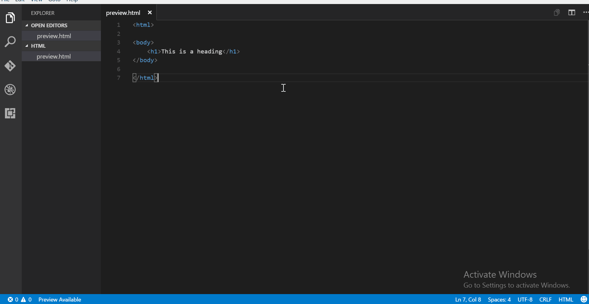

# Live HTML Previewer
This extension allows you to preview your html files in VS Code itself. Use it to quickly set the html and css right for your webpages.
##### Note: Javascript is not supported in preview
### Features
#### Side preview with live editing

#### Full page preview
#### Open html file in browser
### Usage
* For side preview, use the keybinding 'ctrl+q s' or press 'F1' and type "Show side preview"
* For full preview, use the keybinding 'ctrl+q f' or press 'F1' and type "Show full preview"
* To open file in browser: 
    * use the keybinding 'ctrl+q w' or
    * press 'F1' and type "Open in browser" or
    * right click in the editor/side bar, select "Open in browser"

If a HTML file is open, a message is displayed on the Stautus Bar in bottom left. Click on it for side preview.